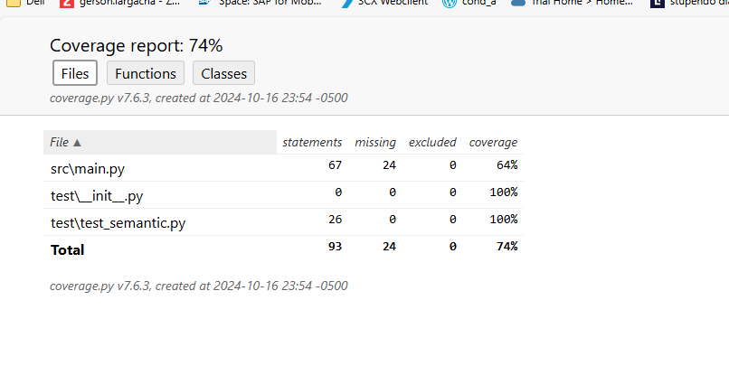

requerimientos 

instalar python minimo 3.10

Install

Clona el repositorio: bash git clone https://github.com/roanbo/semantic_search-1.git cd tu_repositorio

Ejecute eñl siguiente comando 

docker build -t sematic_search .

ejecute el visualizador de imagenes 

docker images 

encuentre el numero de la imagen de semantic search 

USO

Ejecute el siguiente comando para ejecutar 

docker run -it <id-imagen>

El programa solicita las palabras de búsqueda o la palabra para salir(“esc”)

Cuando escribes una palabra en el prompt el programa semántico presentara las coincidencias por pantalla

Cuando en el prompt escribe la palabra "esc" se terminará la ejecución del programa

